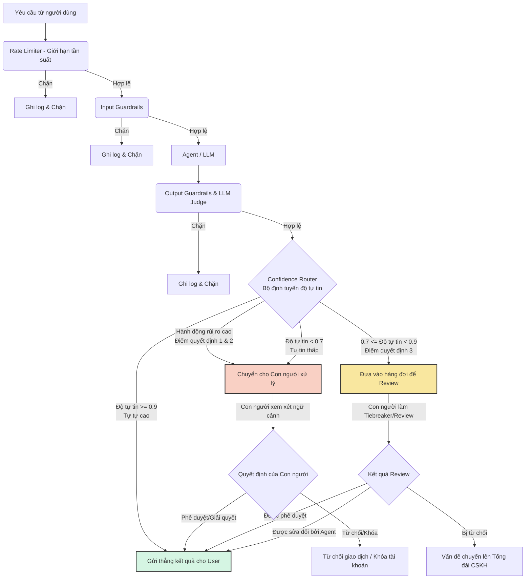

# Sơ đồ Luồng HITL: Pipeline Phòng thủ Đa Lớp

Sơ đồ này phác thảo việc tích hợp Human-in-the-Loop (Con người tham gia vào vòng lặp) bên trong hệ thống phòng thủ của trợ lý ngân hàng, làm nổi bật 3 điểm quyết định chính và các luồng leo thang (escalation).

## Chi tiết các Điểm Quyết định HITL

1. **Phê duyệt Giao dịch Giá trị Cao (Human-in-the-loop):**
   - **Kích hoạt (Trigger):** Hành động có rủi ro cao (VD: chuyển tiền hoặc rút tiền > 10.000$).
   - **Luồng xử lý:** Yêu cầu ngay lập tức được đẩy sang `Chuyển cho Con người xử lý`. Nó yêu cầu sự phê duyệt thủ công rõ ràng từ nhân viên ngân hàng trước khi được tiến hành.

2. **Hoạt động Đăng nhập Đáng ngờ / Khóa tài khoản (Human-on-the-loop):**
   - **Kích hoạt (Trigger):** Các hành vi bất thường hoặc cờ bảo mật bị bật lên (VD: Sai IP truy cập + đổi mật khẩu).
   - **Luồng xử lý:** Yêu cầu được đẩy sang `Chuyển cho Con người xử lý` để đánh giá bảo mật. Nhân viên kiểm tra log và có quyền chặn giao dịch hoặc khóa tài khoản (`Từ chối giao dịch / Khóa tài khoản`).

3. **Xử lý Khiếu nại hoặc Chính sách Mơ hồ (Human-as-tiebreaker):**
   - **Kích hoạt (Trigger):** LLM có độ tự tin trung bình (0.7 - 0.9) khi diễn giải một chính sách vay vốn phức tạp hoặc khi giải quyết một khiếu nại gay gắt từ khách hàng.
   - **Luồng xử lý:** Câu trả lời được đưa vào `Đưa vào hàng đợi để Review`. Một nhân viên chăm sóc khách hàng sẽ đọc ngữ cảnh, đóng vai trò là người ra quyết định cuối cùng (tiebreaker), và sau đó có thể giữ nguyên, chỉnh sửa lại câu trả lời hoặc leo thang vấn đề lên cấp cao hơn.
